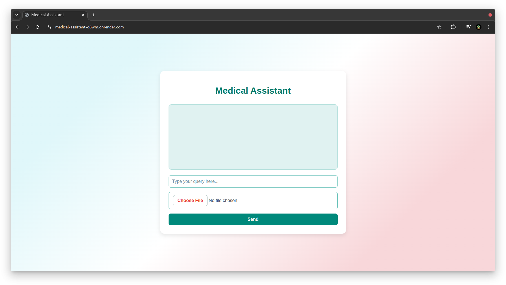

# Medical Assistant

**Medical Assistant** is a simple web-based tool that helps you get information or answers about medical issues. Whether you have a question about a symptom, a condition, or a health-related topic, this assistant can provide helpful responses. You can type a question, upload an image, or use both options together to receive a detailed answer. 

The assistant is powered by advanced artificial intelligence (AI) from OpenAI, which helps analyze your input and generate relevant responses.

## Features

- **Easy-to-Use Interface**: Designed for everyone, Medical Assistant has a simple layout where you can type questions or upload images to get medical information.
- **Multiple Input Options**: You can:
  - Type in a text question (e.g., "What causes headaches?")
  - Upload an image (e.g., a photo of a skin condition)
  - Use both text and image for a combined question
- **Detailed Responses**: The assistant uses AI to understand your input and provide answers tailored to your specific query, whether it’s text, an image, or both.

## How It Works

Medical Assistant uses the **OpenAI API** to process and analyze your input, allowing it to provide accurate and context-aware answers. 

1. **Text Input**: If you have a question or description of a symptom, you can simply type it into the text box.
2. **Image Input**: If you have a relevant image (such as a photo of a medical condition), you can upload it as well.
3. **Combined Input**: You can also type in a question and upload an image at the same time. The assistant will analyze both to provide a more accurate answer.
4. **Response**: The assistant sends your input to the OpenAI API, which analyzes it and generates a detailed response based on its medical knowledge.

### Example Queries

Here are some examples of how you might use Medical Assistant:

- **Text Only**: "What are the symptoms of dehydration?"
- **Image Only**: Upload a photo of a skin rash to get possible explanations.
- **Text + Image**: Type "Is this a normal reaction?" and upload an image of a recent wound or skin condition.

## Getting Started

To use Medical Assistant, you need to have **Go** installed on your computer, and you need an **API key from OpenAI**. Don’t worry if this sounds technical; if you need help, follow the instructions below, or ask someone with technical experience to assist you.

### Installation and Setup

1. **Download the Project**:
   - If you are familiar with Git, you can clone this repository. Otherwise, you can download the project files as a ZIP and extract them to a folder on your computer.

2. **Obtain an OpenAI API Key**:
   - To use the assistant, you need an API key from OpenAI. This is a unique code that lets you access OpenAI's services.
   - Go to [OpenAI's website](https://www.openai.com) to create an account and obtain an API key.
   - Once you have the key, add it to the project’s configuration file. This might be a `.env` file or another configuration file depending on the setup.

3. **Running the Application with Makefile**:
   - Open the terminal (or command prompt) on your computer.
   - Navigate to the project folder where you downloaded or extracted the files.
   - Type the following command and press Enter:
     ```bash
     make run
     ```
   - This command will start the application server.

4. **Access the Application**:
   - Once the server is running, open a web browser (like Chrome or Firefox) and type `http://localhost:5000` in the address bar.
   - This will load the Medical Assistant application interface, where you can start asking questions.

## Using Medical Assistant

1. **Type Your Question**: In the text box, type any question you have about a medical condition or symptom.
2. **(Optional) Upload an Image**: Click the "Choose File" button to upload an image if it’s relevant to your question.
3. **Click "Send"**: Once you’ve entered your question or uploaded an image (or both), click the "Send" button.
4. **View the Response**: The assistant will display the response in the output area, giving you information or advice related to your query.

## Technical Details (for Advanced Users)

- **Language**: This application is built in **Go (Golang)**, a powerful language often used for backend services.
- **OpenAI API**: The assistant relies on the OpenAI API to generate responses. The API uses machine learning models trained on vast amounts of data, making it effective at understanding medical questions and generating relevant answers.
- **Frontend**: The web interface is built with **HTML**, **CSS**, and **jQuery** for simplicity and ease of use.
- **Running with Makefile**: The application can be started with a single command (`make run`) using a Makefile, which simplifies the process of starting the server.

## Example Usage Scenarios

- **Asking about Symptoms**: Type "What are the causes of back pain?" and the assistant will provide possible reasons for back pain.
- **Using an Image for Diagnosis**: Upload a photo of a skin rash or an unusual mark and ask, "What could this be?" The assistant will try to provide potential explanations.
- **Combining Text and Image**: Type a specific question like "Is this a common reaction to a bee sting?" and upload an image of the reaction. The assistant will use both inputs to give a more accurate response.

## Troubleshooting

If you run into any issues:

- **Make sure Go is installed**: Check that Go is installed on your computer by typing `go version` in the terminal.
- **Ensure OpenAI API Key is set up**: Make sure your OpenAI API key is correctly configured in the project files.
- **Check for Errors**: If the application is not responding, check the terminal for error messages. You may need assistance from someone with technical experience if you encounter specific errors.

## Disclaimer

**Medical Assistant is not a substitute for professional medical advice.** Always consult a qualified healthcare provider for accurate diagnosis and treatment. The information provided by this tool is for informational purposes only and should not be used as a basis for any medical decisions.

## Output

### Before Input


### After Input

